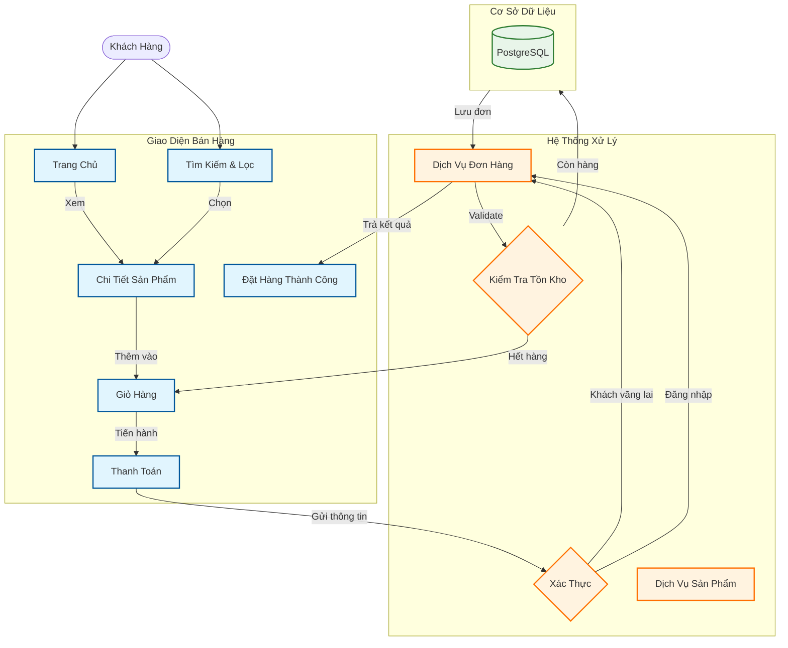
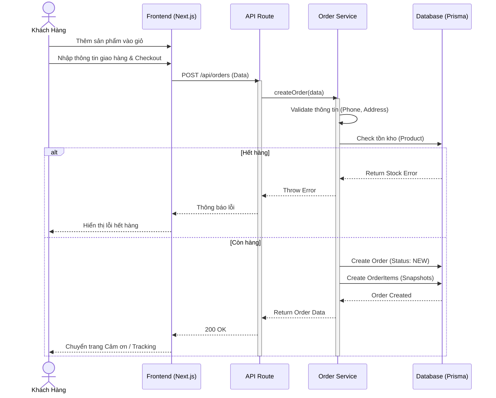
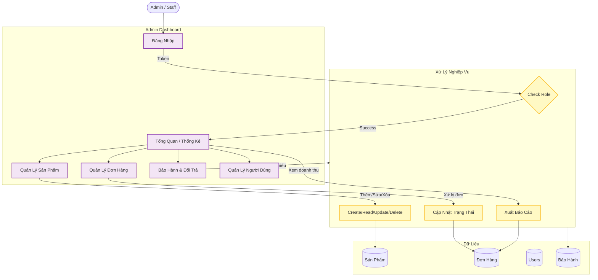
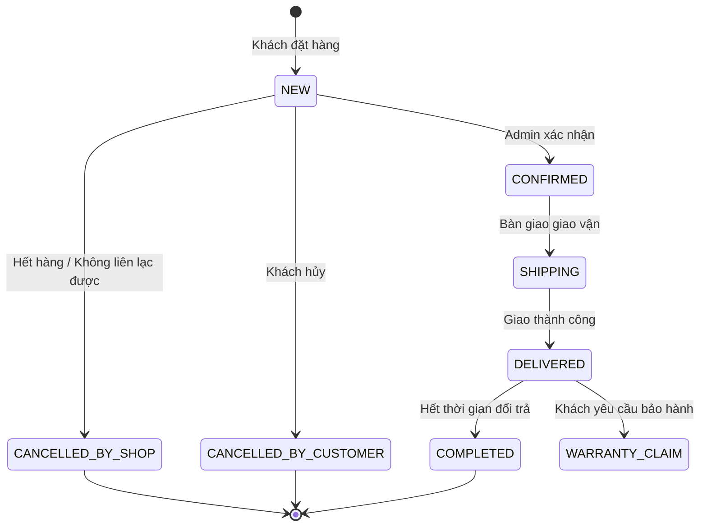

# Sơ Đồ Chức Năng Hệ Thống NamPhongStore

Tài liệu này mô tả luồng hoạt động của hệ thống thông qua các sơ đồ Mermaid, tập trung vào hai phân hệ chính: Bán Hàng (Sales) và Quản Trị (Administration).

## 1. Chức Năng Bán Hàng (Sales Function)

Mô tả quy trình khách hàng tìm kiếm, chọn mua sản phẩm và thanh toán.

### Luồng Xử Lý Đơn Hàng (Sequence Diagram)

## 2. Chức Năng Quản Trị (Administration Function)

Mô tả các chức năng dành cho nhân viên và quản lý để vận hành hệ thống.

### Quy Trình Xử Lý Đơn Hàng (Order Lifecycle)

